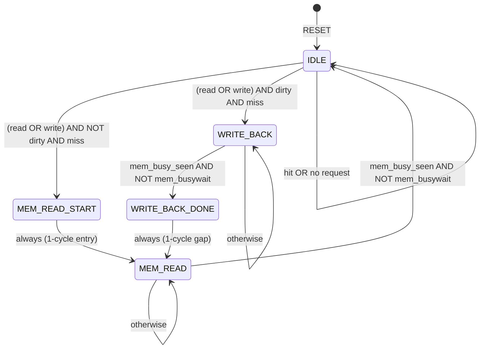

# CO2070 Lab 6 – Cache Analysis Report

**Group 38** | E/22/184 K.P.B.P. Karunanayake | E/22/353 G.K.G. Gayasha Sandeepa

---

## 1. Cache Miss Handling & Write Policies

### 1.1 Write Policies

#### Write-Through
Every write to the cache is **immediately propagated** to main memory.
- ✅ Simple — memory always consistent with cache
- ❌ Slow — every write incurs main memory latency
- ❌ High memory bus traffic

#### Write-Back *(Used in this lab)*
Writes are made **only to the cache**. The modified ("dirty") block is written back to memory only when it is **evicted** (replaced by a new block).
- ✅ Fast — most writes hit only the cache
- ✅ Low bus traffic
- ❌ Complex — needs dirty bit per line

This lab uses **Write-Back + Write-Allocate**:
- **Write-Allocate**: On a write miss, the block is first fetched from memory into the cache, then the write is performed on the cached copy.

---

### 1.2 Read Miss Flowchart


---

### 1.3 Write Miss Flowchart


---

## 2. Cache Mapping Mechanism

### 2.1 Mechanism: Direct-Mapped Cache

This lab implements a **direct-mapped** cache. Each memory block maps to exactly **one** cache line, determined by the index field of the address. If two blocks share the same index (but different tags), they **conflict** and one evicts the other.

**Configuration:**
| Parameter | Value |
|---|---|
| Cache lines | 8 |
| Block size | 4 bytes |
| Mapping | Direct-mapped |
| Write policy | Write-back |
| Allocation policy | Write-allocate |
| Address width | 8 bits |

### 2.2 8-bit Address Bit Format

```
  7   6   5   4   3   2   1   0
┌───┬───┬───┬───┬───┬───┬───┬───┐
│       TAG     │    INDEX  │OFF│
│   bits[7:5]   │ bits[4:2] │[1:0]
└───┴───┴───┴───┴───┴───┴───┴───┘
   3 bits TAG     3 bits IDX   2 bits OFFSET
   (identifies   (selects 1    (byte within
    the block)    of 8 lines)   the 4-byte block)
```

| Field | Bits | Width | Range | Purpose |
|---|---|---|---|---|
| TAG | [7:5] | 3 bits | 0–7 | Identifies which memory region occupies this line |
| INDEX | [4:2] | 3 bits | 0–7 | Selects which of the 8 cache lines to use |
| OFFSET | [1:0] | 2 bits | 0–3 | Selects which byte within the 4-byte block |

### 2.3 Block Address to Memory

The 6-bit block address sent to `dmem.v` is: **`{TAG[2:0], INDEX[2:0]}`**

### 2.4 Address Decomposition Examples

| Address (hex) | Binary | TAG | INDEX | OFFSET | Block addr |
|---|---|---|---|---|---|
| 0x00 | 0000 0000 | 000 | 000 | 00 | 000000 = 0 |
| 0x01 | 0000 0001 | 000 | 000 | 01 | 000000 = 0 |
| 0x04 | 0000 0100 | 000 | 001 | 00 | 000001 = 1 |
| 0x07 | 0000 0111 | 000 | 001 | 11 | 000001 = 1 |
| 0x20 | 0010 0000 | 001 | 000 | 00 | 001000 = 8 |
| 0x24 | 0010 0100 | 001 | 001 | 00 | 001001 = 9 |

> **Cache Conflict Example:** `0x01` (TAG=000, IDX=000) and `0x20` (TAG=001, IDX=000) both map to **cache line 0** but with different tags → conflict!

---

## 3. Cache Table Trace

### Instruction Sequence

```
loadi 0 0x09     → R0 = 0x09  (no memory access)
loadi 1 0x01     → R1 = 0x01  (no memory access)
swd 0 1          → Mem[R1] = R0  → Mem[0x01] = 0x09
swi 1 0x00       → Mem[0x00] = R1 → Mem[0x00] = 0x01
lwd 2 1          → R2 = Mem[R1] = Mem[0x01]
lwd 3 1          → R3 = Mem[R1] = Mem[0x01]
sub 4 0 1        → R4 = R0 - R1 = 0x09 - 0x01 = 0x08  (no memory access)
swi 4 0x07       → Mem[0x07] = R4 = 0x08
lwi 5 0x07       → R5 = Mem[0x07]
lwi 6 0x20       → R6 = Mem[0x20]
swi 4 0x20       → Mem[0x20] = R4 = 0x08
```

### Pre-loaded Memory (from dmem.v)

Memory block `j` is pre-loaded: `byte[offset] = j×4 + offset`

| Block (j) | Byte 0 | Byte 1 | Byte 2 | Byte 3 | Block addr |
|---|---|---|---|---|---|
| 0 | 0x00 | 0x01 | 0x02 | 0x03 | {000,000}=0 |
| 1 | 0x04 | 0x05 | 0x06 | 0x07 | {000,001}=1 |
| 8 | 0x20 | 0x21 | 0x22 | 0x23 | {001,000}=8 |

---

### Cache State: Initial (after RESET)

| Line (INDEX) | Valid | Dirty | TAG | Byte 0 | Byte 1 | Byte 2 | Byte 3 |
|---|---|---|---|---|---|---|---|
| 0 | 0 | 0 | — | — | — | — | — |
| 1 | 0 | 0 | — | — | — | — | — |
| 2 | 0 | 0 | — | — | — | — | — |
| 3 | 0 | 0 | — | — | — | — | — |
| 4 | 0 | 0 | — | — | — | — | — |
| 5 | 0 | 0 | — | — | — | — | — |
| 6 | 0 | 0 | — | — | — | — | — |
| 7 | 0 | 0 | — | — | — | — | — |

---

### Access 1: `swd 0 1` → WRITE to address R1 = **0x01**

```
Address 0x01 = 0000 0001
  TAG=000  INDEX=000  OFFSET=01

Cache Line 0: Valid=0 → MISS (Clean Miss)
Action: Write-Allocate
  1. Fetch block {000,000} from memory → [0x00, 0x01, 0x02, 0x03]
  2. Write R0=0x09 into byte at offset 01 → [0x00, 0x09, 0x02, 0x03]
  3. Set Valid=1, Dirty=1, Tag=000
Miss type: COLD MISS (≈22 stall cycles)
```

| Line | Valid | Dirty | TAG | Byte 0 | Byte 1 | Byte 2 | Byte 3 |
|---|---|---|---|---|---|---|---|
| **0** | **1** | **1** | **000** | **0x00** | **0x09** | **0x02** | **0x03** |
| 1–7 | 0 | 0 | — | — | — | — | — |

---

### Access 2: `swi 1 0x00` → WRITE to address **0x00**

```
Address 0x00 = 0000 0000
  TAG=000  INDEX=000  OFFSET=00

Cache Line 0: Valid=1, Tag=000 == 000 → HIT
Action: Write R1=0x01 into byte at offset 00 → [0x01, 0x09, 0x02, 0x03]
  Dirty remains 1
Miss type: HIT (0 stall cycles)
```

| Line | Valid | Dirty | TAG | Byte 0 | Byte 1 | Byte 2 | Byte 3 |
|---|---|---|---|---|---|---|---|
| **0** | **1** | **1** | **000** | **0x01** | **0x09** | **0x02** | **0x03** |
| 1–7 | 0 | 0 | — | — | — | — | — |

---

### Access 3: `lwd 2 1` → READ from address R1 = **0x01**

```
Address 0x01 = 0000 0001
  TAG=000  INDEX=000  OFFSET=01

Cache Line 0: Valid=1, Tag=000 == 000 → HIT
Action: R2 ← Byte[offset 01] = 0x09
Cache unchanged.
Miss type: HIT (0 stall cycles)
R2 = 0x09
```

| Line | Valid | Dirty | TAG | Byte 0 | Byte 1 | Byte 2 | Byte 3 |
|---|---|---|---|---|---|---|---|
| 0 | 1 | 1 | 000 | 0x01 | 0x09 | 0x02 | 0x03 |
| 1–7 | 0 | 0 | — | — | — | — | — |

---

### Access 4: `lwd 3 1` → READ from address R1 = **0x01**

```
Address 0x01 → same as above
Cache Line 0: HIT
R3 ← Byte[offset 01] = 0x09
Cache unchanged.
Miss type: HIT (0 stall cycles)
R3 = 0x09
```

*(Cache state identical to Access 3 — no change)*

---

### Access 5: `swi 4 0x07` → WRITE to address **0x07**

```
Address 0x07 = 0000 0111
  TAG=000  INDEX=001  OFFSET=11

Cache Line 1: Valid=0 → MISS (Clean Miss)
Action: Write-Allocate
  1. Fetch block {000,001} from memory → [0x04, 0x05, 0x06, 0x07]
  2. Write R4=0x08 into byte at offset 11 → [0x04, 0x05, 0x06, 0x08]
  3. Set Valid=1, Dirty=1, Tag=000
Miss type: COLD MISS (≈22 stall cycles)
```

| Line | Valid | Dirty | TAG | Byte 0 | Byte 1 | Byte 2 | Byte 3 |
|---|---|---|---|---|---|---|---|
| 0 | 1 | 1 | 000 | 0x01 | 0x09 | 0x02 | 0x03 |
| **1** | **1** | **1** | **000** | **0x04** | **0x05** | **0x06** | **0x08** |
| 2–7 | 0 | 0 | — | — | — | — | — |

---

### Access 6: `lwi 5 0x07` → READ from address **0x07**

```
Address 0x07 = 0000 0111
  TAG=000  INDEX=001  OFFSET=11

Cache Line 1: Valid=1, Tag=000 == 000 → HIT
Action: R5 ← Byte[offset 11] = 0x08
Cache unchanged.
Miss type: HIT (0 stall cycles)
R5 = 0x08
```

*(Cache state identical to Access 5 — no change)*

---

### Access 7: `lwi 6 0x20` → READ from address **0x20**

```
Address 0x20 = 0010 0000
  TAG=001  INDEX=000  OFFSET=00

Cache Line 0: Valid=1, Tag=000 ≠ 001 → MISS
              Dirty=1 → DIRTY MISS (write-back required!)

Action:
  1. Write-back Line 0 to memory:
       Block {000,000} ← [0x01, 0x09, 0x02, 0x03]  (evicts modified data)
  2. Fetch new block {001,000} (block 8) from memory → [0x20, 0x21, 0x22, 0x23]
  3. Set Valid=1, Dirty=0, Tag=001
  4. R6 ← Byte[offset 00] = 0x20

Miss type: DIRTY MISS (≈43 stall cycles: 20 write-back + 1 gap + 20 fetch)
R6 = 0x20
```

| Line | Valid | Dirty | TAG | Byte 0 | Byte 1 | Byte 2 | Byte 3 |
|---|---|---|---|---|---|---|---|
| **0** | **1** | **0** | **001** | **0x20** | **0x21** | **0x22** | **0x23** |
| 1 | 1 | 1 | 000 | 0x04 | 0x05 | 0x06 | 0x08 |
| 2–7 | 0 | 0 | — | — | — | — | — |

---

### Access 8: `swi 4 0x20` → WRITE to address **0x20**

```
Address 0x20 = 0010 0000
  TAG=001  INDEX=000  OFFSET=00

Cache Line 0: Valid=1, Tag=001 == 001 → HIT
Action: Write R4=0x08 into byte at offset 00 → [0x08, 0x21, 0x22, 0x23]
  Set Dirty=1
Miss type: HIT (0 stall cycles)
```

| Line | Valid | Dirty | TAG | Byte 0 | Byte 1 | Byte 2 | Byte 3 |
|---|---|---|---|---|---|---|---|
| **0** | **1** | **1** | **001** | **0x08** | **0x21** | **0x22** | **0x23** |
| 1 | 1 | 1 | 000 | 0x04 | 0x05 | 0x06 | 0x08 |
| 2–7 | 0 | 0 | — | — | — | — | — |

---

### Summary Table

| # | Instruction | Address | TAG | IDX | OFF | Hit/Miss | Type | Stall Cycles | Result |
|---|---|---|---|---|---|---|---|---|---|
| 1 | `swd 0 1` | 0x01 | 000 | 0 | 01 | **MISS** | Clean (Write-Allocate) | ~22 | Mem[0x01]←0x09 |
| 2 | `swi 1 0x00` | 0x00 | 000 | 0 | 00 | **HIT** | Write-hit | 0 | Mem[0x00]←0x01 |
| 3 | `lwd 2 1` | 0x01 | 000 | 0 | 01 | **HIT** | Read-hit | 0 | R2=0x09 |
| 4 | `lwd 3 1` | 0x01 | 000 | 0 | 01 | **HIT** | Read-hit | 0 | R3=0x09 |
| 5 | `swi 4 0x07` | 0x07 | 000 | 1 | 11 | **MISS** | Clean (Write-Allocate) | ~22 | Mem[0x07]←0x08 |
| 6 | `lwi 5 0x07` | 0x07 | 000 | 1 | 11 | **HIT** | Read-hit | 0 | R5=0x08 |
| 7 | `lwi 6 0x20` | 0x20 | 001 | 0 | 00 | **MISS** | Dirty (Write-Back) | ~43 | R6=0x20 |
| 8 | `swi 4 0x20` | 0x20 | 001 | 0 | 00 | **HIT** | Write-hit | 0 | Mem[0x20]←0x08 |

**Total memory accesses: 8 | Hits: 5 | Misses: 3 (2 clean + 1 dirty)**

---

## 4. Completed FSM Skeleton

The `dcacheFSM_skeleton.v` provided on Feels shows an incomplete FSM with only `IDLE` and `MEM_READ` states, and several blanks. Below is the completed version with all states and transitions.

### 4.1 FSM States

| State | Code | Description |
|---|---|---|
| `IDLE` | 3'b000 | Normal; hits resolved combinationally |
| `MEM_READ` | 3'b001 | Waiting for memory to deliver a fetched block |
| `WRITE_BACK` | 3'b010 | Evicting a dirty block to memory |
| `WRITE_BACK_DONE` | 3'b011 | 1-cycle gap after write-back; start fetch |
| `MEM_READ_START` | 3'b100 | 1-cycle entry for clean miss; drive mem_read |

### 4.2 Completed FSM State Diagram



### 4.3 Completed Verilog FSM Code

```verilog
/*
Module  : Data Cache (Completed FSM)
Author  : Isuru Nawinne, Kisaru Liyanage (skeleton)
          Completed by Group 38
Date    : 25/05/2020 (skeleton)

Description:
This completes the cache controller FSM skeleton from Feels.
Write-back + Write-allocate, direct-mapped, 8 lines x 4 bytes.
*/

module dcache (...);

    /*
    Combinational part for indexing, tag comparison, hit detection...
    (see dcache.v for full implementation)
    */

    /* Cache Controller FSM */

    parameter IDLE            = 3'b000;
    parameter MEM_READ        = 3'b001;
    parameter WRITE_BACK      = 3'b010;   // ← ADDED (not in skeleton)
    parameter WRITE_BACK_DONE = 3'b011;   // ← ADDED (not in skeleton)
    parameter MEM_READ_START  = 3'b100;   // ← ADDED (not in skeleton)

    reg [2:0] state, next_state;
    reg mem_busy_seen;  // prevents premature exit before memory asserts busy

    // ── Combinational next-state logic ──────────────────────────────
    always @(*)
    begin
        case (state)

            IDLE:
                if ((read || write) && !dirty && !hit)
                    next_state = MEM_READ_START;    // ← was MEM_READ in skeleton
                else if ((read || write) && dirty && !hit)  // ← FILLED blank
                    next_state = WRITE_BACK;                // ← FILLED blank
                else
                    next_state = IDLE;

            MEM_READ_START:                         // ← NEW state
                next_state = MEM_READ;              // 1-cycle entry, always move on

            MEM_READ:
                if (mem_busy_seen && !mem_busywait) // ← added mem_busy_seen guard
                    next_state = IDLE;              // ← FILLED blank
                else
                    next_state = MEM_READ;

            WRITE_BACK:                             // ← NEW state
                if (mem_busy_seen && !mem_busywait)
                    next_state = WRITE_BACK_DONE;
                else
                    next_state = WRITE_BACK;

            WRITE_BACK_DONE:                        // ← NEW state
                next_state = MEM_READ;              // start fetch after eviction

            default:
                next_state = IDLE;

        endcase
    end

    // ── Combinational output logic ───────────────────────────────────
    always @(*)
    begin
        case(state)

            IDLE:
            begin
                mem_read      = 0;
                mem_write     = 0;
                mem_address   = 6'bx;
                mem_writedata = 32'bx;
                busywait      = (read || write) && miss;  // ← miss not !hit (avoids X)
            end

            MEM_READ_START:                         // ← NEW state output
            begin
                mem_read      = 1;
                mem_write     = 0;
                mem_address   = {tag, index};
                mem_writedata = 32'bx;
                busywait      = 1;
            end

            MEM_READ:
            begin
                mem_read      = 1;
                mem_write     = 0;
                mem_address   = {tag, index};       // ← FILLED (new block address)
                mem_writedata = 32'bx;
                busywait      = 1;
            end

            WRITE_BACK:                             // ← NEW state output
            begin
                mem_read      = 0;
                mem_write     = 1;
                mem_address   = {cached_tag, index}; // old tag — evicted block
                mem_writedata = cached_block;         // full dirty block data
                busywait      = 1;
            end

            WRITE_BACK_DONE:                        // ← NEW state output
            begin
                mem_read      = 1;                  // start fetch immediately
                mem_write     = 0;
                mem_address   = {tag, index};
                mem_writedata = 32'bx;
                busywait      = 1;
            end

            default:
            begin
                mem_read      = 0;
                mem_write     = 0;
                mem_address   = 6'bx;
                mem_writedata = 32'bx;
                busywait      = 0;
            end

        endcase
    end

    // ── Sequential: state register + cache array updates ────────────
    always @(posedge clock, reset)
    begin
        if (reset) begin
            state         <= IDLE;
            mem_busy_seen <= 0;
            // clear all cache lines (valid=0, dirty=0, tag=0, data=0)
        end else begin
            state <= next_state;

            // Track whether mem_busywait has gone high (guards premature exit)
            if (state == IDLE || state == MEM_READ_START || state == WRITE_BACK_DONE)
                mem_busy_seen <= 0;
            else if ((state == MEM_READ || state == WRITE_BACK) && mem_busywait)
                mem_busy_seen <= 1;

            // Write fetched block into cache when MEM_READ completes
            if (state == MEM_READ && mem_busy_seen && !mem_busywait) begin
                #1;
                data_array [index] <= mem_readdata;
                tag_array  [index] <= tag;
                valid_array[index] <= 1;
                dirty_array[index] <= 0;        // freshly fetched → clean
            end

            // Write-hit: commit CPU write to cache (synchronous)
            if (state == IDLE && write && hit) begin
                #1;
                // update the appropriate byte based on offset
                dirty_array[index] <= 1;
            end
        end
    end

    /* Cache Controller FSM End */

endmodule
```

### 4.4 Key Differences: Skeleton vs. Completed

| Element | Skeleton (Feels) | Completed |
|---|---|---|
| States | 2 (IDLE, MEM_READ) | 5 (+ WRITE_BACK, WRITE_BACK_DONE, MEM_READ_START) |
| Dirty miss handling | `else if (...)` blank | `else if ((read\|\|write) && dirty && !hit)` |
| Dirty miss next state | `next_state = ...` blank | `next_state = WRITE_BACK` |
| MEM_READ exit | `next_state = ...` blank | `next_state = IDLE` |
| IDLE busywait | `busywait = 0` (always) | `busywait = (read\|\|write) && miss` |
| IDLE mem_address | `8'dx` (8-bit wrong width) | `6'bx` (correct 6-bit block addr) |
| mem_busy_seen guard | Not present | Added to prevent premature FSM exit |

---

## 5. FSM Timing Summary

```
Clean Miss Path (dirty=0):
  IDLE → MEM_READ_START (1 cycle)
       → MEM_READ        (20 cycles, waiting for memory)
       → IDLE
  Total stall ≈ 22 cycles

Dirty Miss Path (dirty=1):
  IDLE → WRITE_BACK      (20 cycles, evict old block)
       → WRITE_BACK_DONE (1 cycle gap)
       → MEM_READ        (20 cycles, fetch new block)
       → IDLE
  Total stall ≈ 43 cycles

Hit Path:
  IDLE → IDLE (combinational, ~1.9ns, 0 stall cycles)
```

---

*CO2070 Computer Architecture – Department of Computer Engineering, University of Peradeniya*
